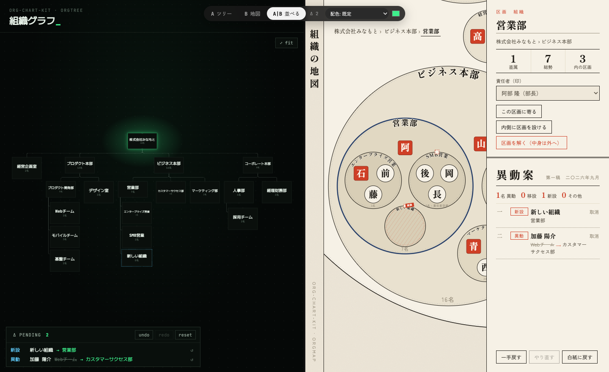
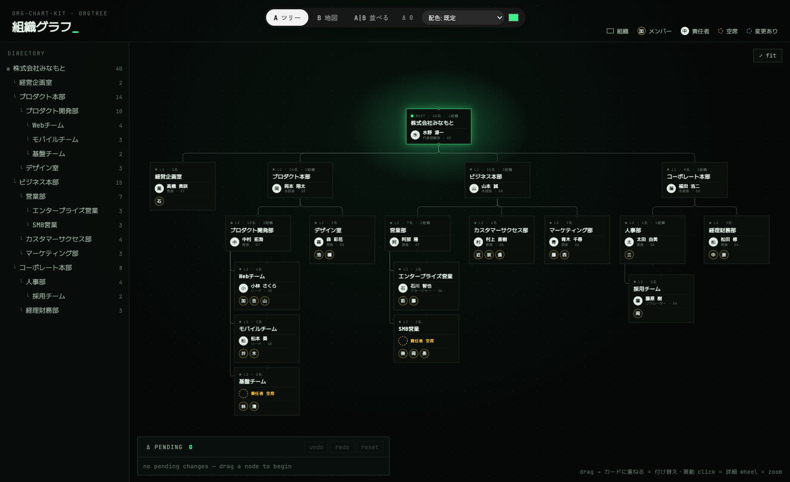
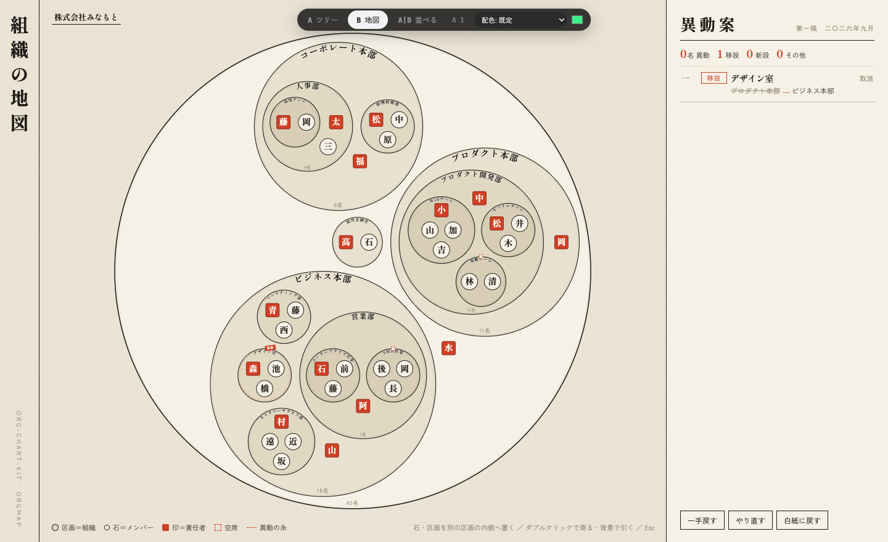
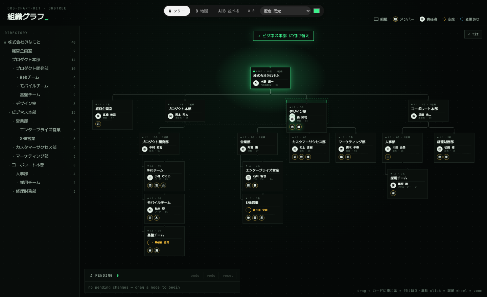
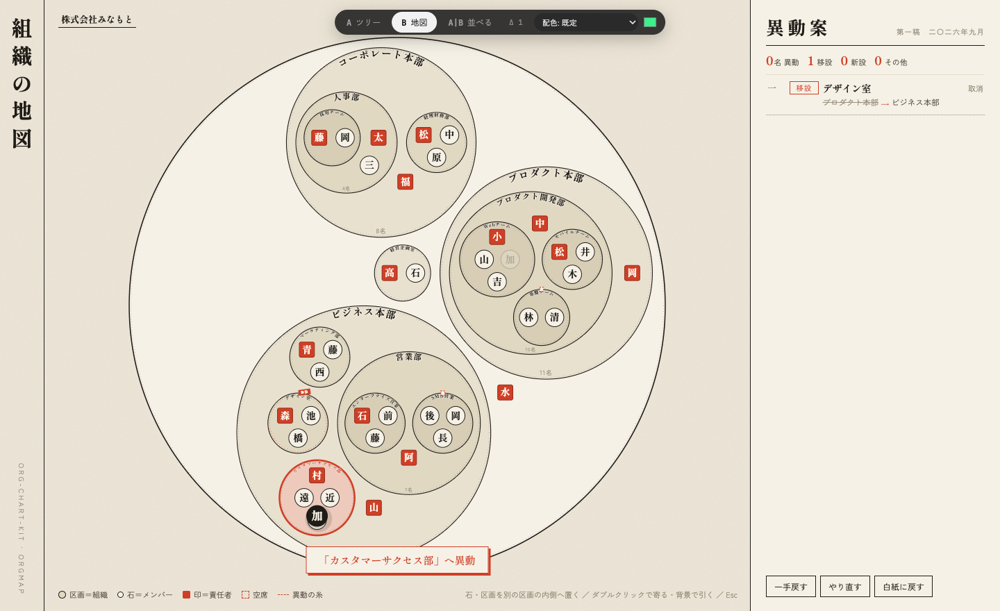
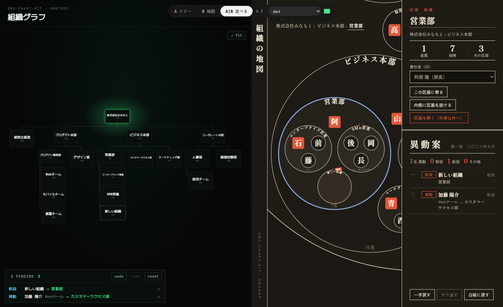
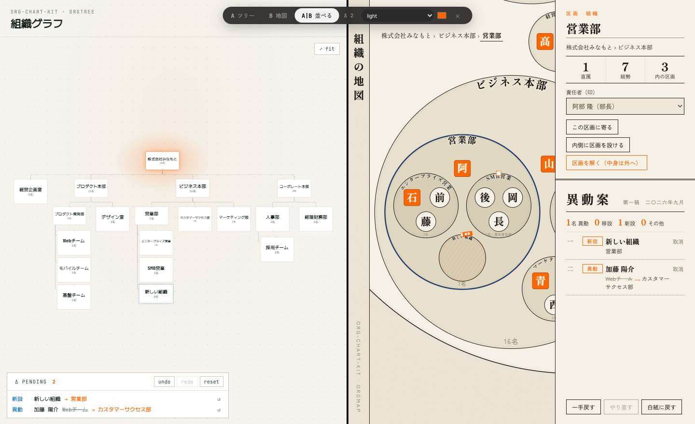
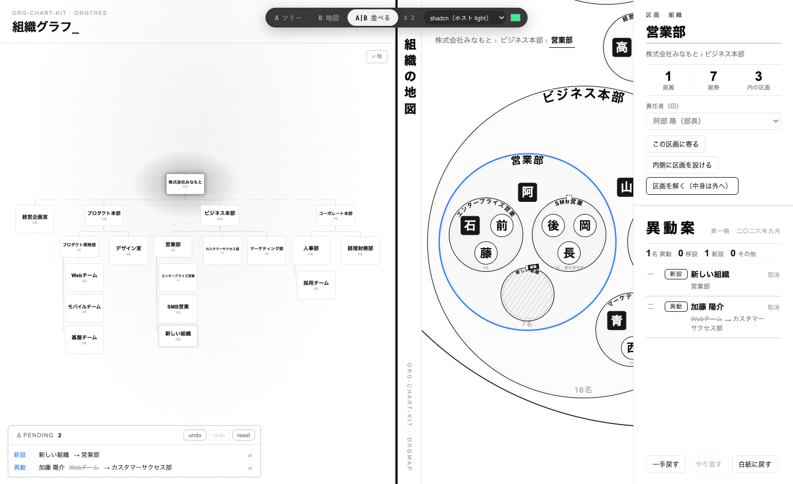
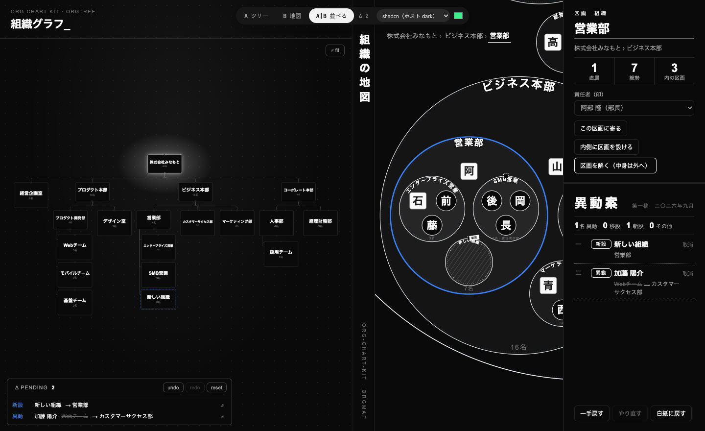

# org-chart-kit

組織図を **目で見て、そのまま直す** ための React コンポーネントと編集コアです。

- **OrgTree** — トップダウンの組織ツリーです。見た目は黒地・緑アクセント・等幅フォントです。
  - 組織は「コンソールカード」で表します。カードには、深さと人数の見出し、組織名、責任者の席、直属メンバーのグリフ（名字の一文字）が載ります。責任者がいない組織は、席が破線の「空席」になります。
  - 子がすべて葉の組織は、子を縦に積んでレールでつなぎます。こうすると、横に広がりすぎません。
  - 大きく引くと、カードの中身を畳んで組織名だけを大きく表示します。
  - カードをつかむと配下の枝ごと持ち上がり、別のカードに重ねると付け替えになります。グリフを別のカードに重ねると異動になります。
- **OrgMap** — 組織を入れ子の区画、メンバーを石で表す「地図」です。見た目は紙・墨・朱です。
  - 責任者は朱の角印で表し、区画の上座（いちばん上）に置きます。
  - 石や区画を別の区画の内側へ置くと、異動や付け替えになります。
- **コア（React 非依存）** — データ型、編集操作、ベースラインとの差分（変更案）、個別取消、undo/redo の履歴をまとめたものです。



| OrgTree | OrgMap |
|---|---|
|  |  |
|  |  |

## 使い方

```tsx
import { OrgMap, OrgTree, useOrgEditor } from 'org-chart-kit/react';
import 'org-chart-kit/styles.css';

function Editor({ org }: { org: OrgState }) {
  const editor = useOrgEditor(org, { hotkeys: true, onChange: (s) => console.log(s) });
  return (
    <div style={{ position: 'relative', height: 720 }}>
      <OrgTree store={editor} />
    </div>
  );
}
```

- 各ビューは **親要素いっぱい**（`position: absolute; inset: 0`）に広がります。親要素には高さと `position: relative` を持たせてください。
- 同じ `editor` を `OrgTree` と `OrgMap` の両方に渡すと、どちらで編集しても、もう一方にそのまま反映されます。
- `editor.changes` は、ベースラインとの差分（変更案）です。保存したら `editor.commit()` を呼んでください。現在の状態が新しいベースラインになります。
- `hotkeys` は既定でオフです。オンにすると、⌘Z / ⇧⌘Z を `window` で受け取ります。ホストアプリの undo を奪わないように、既定はオフにしています。

### データ

```ts
type Org = { id: string; name: string; parentId: string | null; headId: string | null };
type Member = { id: string; name: string; title: string; grade: string; orgId: string };
type OrgState = { orgs: Record<string, Org>; members: Record<string, Member> };
```

- 組織は種別（本部・部・チーム）を持ちません。`parentId` で何段でも入れ子にできます。
- ルートの組織の ID は `'root'`（`ROOT_ID`）です。
- 責任者（`headId`）には、その組織の直属メンバーだけを設定できます。

### 編集操作（コア）

| Action | 内容 |
|---|---|
| `moveOrg` | 親の付け替え。自分の配下へ移す操作（循環）や、ルートを動かす操作は拒否します |
| `moveMember` | 異動。その人が元の組織の責任者だった場合、元の組織の責任者は空席になります |
| `renameOrg` / `addOrg` | 改称・新設 |
| `deleteOrg` | 解散。子組織とメンバーは親の組織へ繰り上げます |
| `setHead` | 責任者の設定 |

- `apply(state, action)` は、不正な操作に対して `null` を返します。
- `diff(base, cur)` は変更案の一覧を返します。
- `revertAction(cur, change)` は、その変更1件だけを戻す操作を返します。
- `describe(base, cur, change)` は、変更1件を「誰が・どこから・どこへ」に分解して返します。

## テーマ

### プリセット

`theme` に `'light' | 'dark' | 'auto' | 'shadcn' | 'shadcn-v4'` を指定できます。`'auto'` は OS の配色設定（prefers-color-scheme）に従います。既定は、OrgTree が `'dark'`、OrgMap が `'light'` です。

```tsx
<OrgTree store={editor} theme="light" />
<OrgMap store={editor} theme="auto" />
```

| dark（ツリー既定 / 地図） | light（ツリー / 地図既定）＋ アクセント色を上書き |
|---|---|
|  |  |

### shadcn/ui のアプリに合わせる

`theme="shadcn"` は、ホストアプリの shadcn/ui のテーマ変数をそのまま読みます。使う変数は `--background` `--foreground` `--card` `--muted` `--muted-foreground` `--primary` `--primary-foreground` `--border` `--destructive` `--chart-2` `--radius` `--sidebar-ring` です。

- 配色・角丸・フォント（`inherit`）がホストに揃います。
- ホスト側で light/dark を切り替えると（`.dark` クラス）、それにも自動で追従します。

```tsx
// Tailwind v3 系の shadcn（`--primary: 0 0% 9%` のような HSL の三つ組）
<OrgTree store={editor} theme="shadcn" />
// Tailwind v4 系の shadcn（`--primary: oklch(0.205 0 0)` のような色そのもの）
<OrgMap store={editor} theme="shadcn-v4" />
```

割り当ては次のとおりです。
- 選択・責任者の印は `--primary`（黒または白）です。
- 変更ありの印と選択中の区画は `--sidebar-ring`（青）です。この変数がないホストでは、Tailwind の blue-500 相当になります。
- メンバーの点は `--chart-2` です。
- 地図の紙の質感は無地にしています。

特定の色だけ変えたいときは、トークンで上書きしてください（例: `tokens={{ member: 'hsl(var(--chart-1))' }}`）。

| shadcn（ホスト light） | shadcn（ホスト dark） |
|---|---|
|  |  |

### トークン（CSS 変数 `--ock-*`）

色とフォントは、すべて `--ock-*` の CSS 変数で上書きできます。上書きのしかたは次の3通りで、どれでも同じ結果になります。**利用側で指定した値が、常にプリセットより優先されます。**

```tsx
// 1. tokens prop（型が付く）
<OrgTree store={editor} tokens={{ accent: '#ff6600', 'font-body': "'IBM Plex Mono', monospace" }} />
```
```css
/* 2. 祖先要素で（アプリ全体のテーマに合わせるとき） */
.my-app { --ock-accent: #ff6600; --ock-seal: #ff6600; }

/* 3. 特定のビューだけ */
.ock-map.brand { --ock-grain: none; }
```

`accent-soft` のように「自動計算」と書いたトークンは、元の色（`accent` など）から `color-mix()` で作っています。元の色だけを変えれば、これらも追従します。直接上書きしても構いません。

**共通**（OrgTree / OrgMap）

| トークン | 用途 |
|---|---|
| `bg` | 背景 |
| `surface` / `surface-2` | パネル・カードの面 / 一段沈んだ面 |
| `text` / `text-2` / `text-3` | 本文と線の基本色 / 補助テキスト / 淡いテキスト |
| `font-body` | 本文フォント（`font-family` の値。`inherit` でホストに合わせる） |
| `radius` | ボタン・入力・パネルの角丸（既定 `0`） |

**OrgTree**

| トークン | 用途 |
|---|---|
| `border` / `border-strong` | 罫線 |
| `accent` | 選択・確定・コアの色（既定は緑） |
| `accent-soft` / `accent-line` / `glow` | accent の淡い面・淡い線・発光（自動計算） |
| `member` | メンバーの点 |
| `danger` | 移せない・解散 |
| `changed` | 変更あり（Δ）の印と、変更ログの動詞 |
| `grid` | 背景のドット |
| `shadow` | 詳細パネルの影 |

**OrgMap**

| トークン | 用途 |
|---|---|
| `font-display` | 見出し・組織名・石の文字 |
| `line` | 罫線・枠（既定: `text` と同じ墨色） |
| `seal` | 朱。責任者の印・異動の糸・落とし先 |
| `seal-soft` / `seal-edge` | 朱の淡い面 / 印の縁（自動計算） |
| `on-seal` | 朱の上に載る文字 |
| `select` / `select-soft` | 藍。選択中の区画・石 / その淡い面（自動計算） |
| `drop` | 落とせる区画の塗り（`seal` と `surface` から自動計算） |
| `depth-1` 〜 `depth-4` | 区画の塗り（深い区画ほど濃く） |
| `tip-accent` | ツールチップに出る所属名 |
| `grain` | 紙の質感（`background-image` の値。`none` で無地） |

トークン名は `ORG_TREE_TOKENS` / `ORG_MAP_TOKENS` としても export しています。型定義と CSS のあいだで過不足がないことは、テスト（`test/theme.test.ts`）で確認しています。

## フォント

ライブラリ自体はフォントを読み込みません。既定では次のフォントがあることを前提にしていて、ない場合は代わりのフォントで表示されます。別のフォントにしたい場合は、`font-body` / `font-display` トークンで差し替えてください。

- OrgTree: JetBrains Mono
- OrgMap: Shippori Mincho B1 / Zen Kaku Gothic New

## 開発

```bash
bun install
bun run test        # コアとテーマトークンの単体テスト（vitest）
bun run build       # dist/ に index / react / styles.css と型定義を出力し、コアが React に依存していないことも検査
bun run dev         # playground（http://localhost:5191, #a / #b / #split）
bun run e2e         # playground を実ブラウザで操作するスモークテスト（dev を起動しておく）
bun run e2e -- shots  # 同時に docs/ のスクリーンショットを更新
```

## クレジット

OrgTree の見た目は FounderOS の G-Brain（ナレッジグラフ）を参考にしています。
